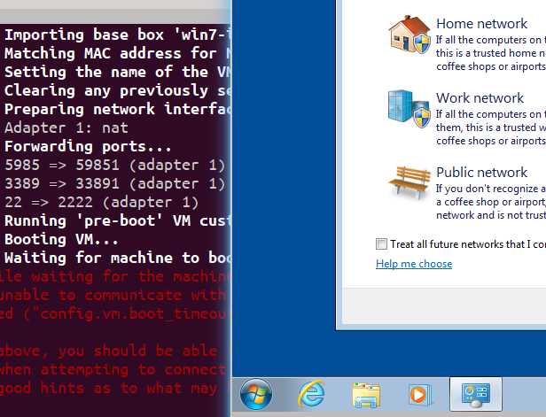

# Lancer une VM Windows avec Vagrant

Vagrant est un système de gestion de machines virtuelles qui permet de créer une VM, et de vous y connecter, en quelques lignes de commandes. Par exemple pour la dernière version d'Ubuntu :

    vagrant init ubuntu/trusty64
    vagrant up
    vagrant ssh

D'autres VM avec plusieurs versions de Windows et d'IE ont été mises à disposition par Microsoft pour les développeurs Web, et on peut théoriquement les utiliser aussi facilement :

    vagrant box add win7-ie11 http://aka.ms/vagrant-win7-ie11
    vagrant init win7-ie11
    vagrant up
    vagrant rdp

En pratique c'est plus compliqué, car aucun accès à distance n'est configuré par défaut. Pas de SSH, et pas de RDP (le protocole de Microsoft).

- Le premier symptôme est un timeout, au moment où Vagrant essaie de se connecter à la VM pour vérifier qu'elle est bien démarrée.

- On ne peut pas non plus manipuler notre VM avec Vagrant, pour éteindre la VM ou pour la redémarrer.

Nous allons voir comment personnaliser une box Microsoft pour corriger ces problèmes.

## Pré-requis

- Vagrant 1.7
- VirtualBox
- Un gestionnaire de téléchargement, par exemple la commande `wget`
- Une bonne connexion internet ou bien quelques heures de patience, pour télécharger les VM
- Un client Microsoft Remote Desktop (Linux : rdesktop ; Mac : TODO, Windows : TODO)

## Personnalisation

Téléchargez la box Vagrant : `wget -c http://aka.ms/vagrant-win7-ie11`

La commande `wget -c` peut être relancée pour reprendre le téléchargement en cas d'interruption. Ca peut être très long.

Créez votre fichier Vagrantfile :

    Vagrant.configure(2) do |config|
        config.vm.guest = :windows
        # Configuration de winrm, qui rend la VM scriptable depuis
        # l'extérieur.
        config.vm.communicator = "winrm"
        # Identifiants pour que Vagrant puisse commander la VM
        config.winrm.username = "IEUser"
        config.winrm.password = "Passw0rd!"
        # Ouverture du port réseau de winrm
        config.vm.network :forwarded_port, guest: 5985, host: 59851,
            id: "winrm", auto_correct:true
        # Ouverture du port du remote desktop protocol
        config.vm.network :forwarded_port, guest: 3389, host: 33891,
            id: "rdp", auto_correct:true
        # Chemin de la box qui sera importée au premier démarrage
        config.vm.box_url = "file://vagrant-win7-ie11"
        # Timeout rapide (30 s) au premier démarrage
        config.vm.boot_timeout = 30
        # Nom de la box
        config.vm.box = "win7-ie11"

        # Configuration spécifique à la techno de virtualisation
        # utilisée
        config.vm.provider "virtualbox" do |vb|
            # Afficher l'interface graphique Windows
            vb.gui = true
            # Mémoire vive
            vb.memory = "1024"
        end
    end

### Premier lancement

Lancez la commande `vagrant up` :

    $ vagrant up
    Bringing machine 'default' up with 'virtualbox' provider...
    ==> default: Importing base box 'win7-ie11'...
    ==> default: Matching MAC address for NAT networking...
    ==> default: Setting the name of the VM: vagrant-win-ie_default_1427923643091_51251
    ==> default: Clearing any previously set network interfaces...
    ==> default: Preparing network interfaces based on configuration...
        default: Adapter 1: nat
    ==> default: Forwarding ports...
        default: 5985 => 59851 (adapter 1)
        default: 3389 => 33891 (adapter 1)
        default: 22 => 2222 (adapter 1)
    ==> default: Running 'pre-boot' VM customizations...
    [...]

Vagrant affiche un message de timeout. Pas la peine d'augmenter la valeur dans le Vagrantfile, car il utilise WinRM pour accéder à la machine, et ce n'est pas encore autorisé :

    [...]
    ==> default: Booting VM...
    ==> default: Waiting for machine to boot. This may take a few minutes...
    Timed out while waiting for the machine to boot. This means that
    Vagrant was unable to communicate with the guest machine within
    the configured ("config.vm.boot_timeout" value) time period.

    If you look above, you should be able to see the error(s) that
    Vagrant had when attempting to connect to the machine. These errors
    are usually good hints as to what may be wrong.

    If you're using a custom box, make sure that networking is properly
    working and you're able to connect to the machine. It is a common
    problem that networking isn't setup properly in these boxes.
    Verify that authentication configurations are also setup properly,
    as well.

    If the box appears to be booting properly, you may want to increase
    the timeout ("config.vm.boot_timeout") value.

Pourtant elle est démarrée, puisque nous voyons l'interface graphique de Windows :

Configurer le réseau Windows en choisissant "home network".

La VM n'accepte pas encore les commandes Vagrant, par exemple `vagrant halt`, `vagrant reload` :

    $ vagrant halt
    ==> default: Attempting graceful shutdown of VM...
    ^C==> default: Waiting for cleanup before exiting...
    ^C==> default: Exiting immediately, without cleanup!

J'ai fait deux fois Ctrl-C pour interrompre la VM brutalement, mais il faudrait quand même l'éteindre par le menu Démarrer de Windows.

Pour régler ça, ouvrez un terminal Windows en tant qu'administrateur dans la VM et lancez ces commandes :

    winrm quickconfig -q
    powershell Set-Item WSMan:\localhost\Service\AllowUnencrypted -Value True
    powershell Set-Item WSMan:\localhost\Service\Auth\Basic -Value True

Refaites un `vagrant halt`, ça devrait marcher.

### Finalisation

Passez `vb.gui` à `false` pour lancer la VM en _headless_, et le timeout à 5 minutes pour lui laisser le temps de démarrer (sur mon MacBook Pro 2015, elle prend 2-3 minutes) :

    [...]
    # Timeout suffisant pour le démarrage de Windows
    config.vm.boot_timeout = 300

    # Configuration spécifique à la techno de
    # virtualisation utilisée
    config.vm.provider "virtualbox" do |vb|
        # Démarrage headless
        vb.gui = false
    [...]

Refaites un `vagrant up` pour tester le démarrage de la VM. Il ne doit pas y avoir de timeout :

    $ vagrant up
    Bringing machine 'default' up with 'virtualbox' provider...
    ==> default: Clearing any previously set forwarded ports...
    ==> default: Clearing any previously set network interfaces...
    ==> default: Preparing network interfaces based on configuration...
        default: Adapter 1: nat
    ==> default: Forwarding ports...
        default: 5985 => 59851 (adapter 1)
        default: 3389 => 33891 (adapter 1)
        default: 22 => 2222 (adapter 1)
    ==> default: Running 'pre-boot' VM customizations...
    ==> default: Booting VM...
    ==> default: Waiting for machine to boot. This may take a few minutes...
    ==> default: Machine booted and ready!
    ==> default: Checking for guest additions in VM...
        default: The guest additions on this VM do not match the installed version of
        default: VirtualBox! In most cases this is fine, but in rare cases it can
        [...]
    ==> default: Mounting shared folders...
        default: /vagrant => /home/cp/WORKSPACES/vagrant-win-ie

Pour valider l'installation, accédez à la VM en local avec un client RDP grâce à la commande `vagrant rdp` (identifiants : IEUser/Passw0rd!) :

## TODO TODO : Distribution

Repackagez la box :

    vagrant box repackage NAME PROVIDER VERSION
    TODO command output

Copiez la box repackagée sur un serveur web accessible à votre équipe :

    TODO commande copie
    TODO vérification du fichier

Configurez l'URL d'accès à cette box dans le Vagrantfile :

    TODO

Déployez votre Vagrantfile sur une repository accessible à votre équipe, par exemple Git :

    git init
    git remote add http://github.com/geekarist/vagrant-ie.git
    git commit -a -m 'Initial version: custom IE VM'
    git push

## Utilisation

Clonez la repository où est déployé votre Vagrantfile : `git clone http://github.com/geekarist/vagrant-ie.git`

Allez dans le nouveau répertoire, et faites un `vagrant up` pour lancer la VM. Vagrant va télécharger la box repackagée et cette fois-ci, il ne doit pas y avoir de timeout.

Vous pouvez directement manipuler la VM avec Vagrant : `vagrant halt`, `vagrant reload`, etc.

Vous pouvez vous y connecter en local avec un `vagrant rdp`, ou à distance avec le client _remote desktop_ de Microsoft. Si vous avez un iPad sous la main, TODO : RD client sur iPad.

TODO : références (winrm, rdp, doc vagrant, virtualbox)
